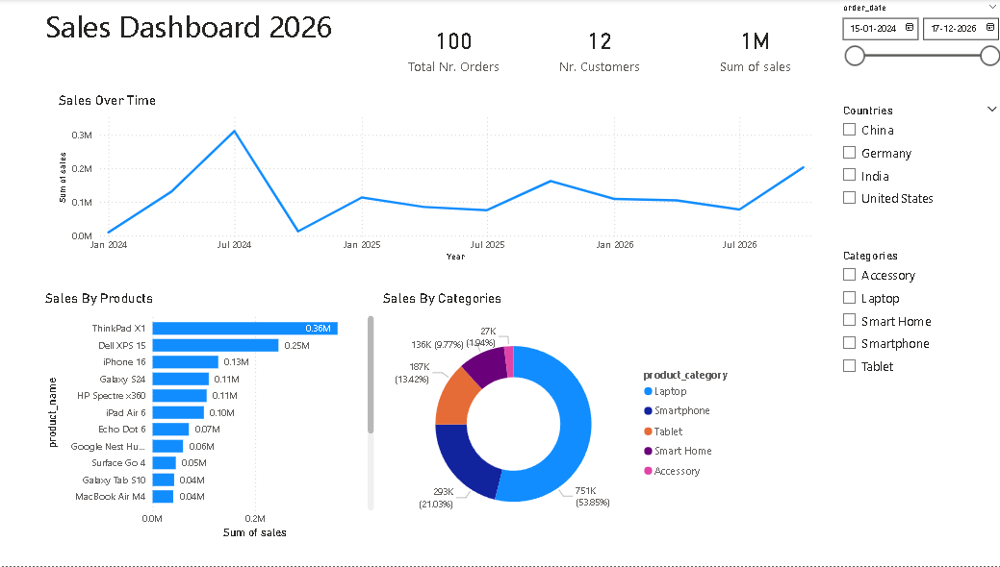
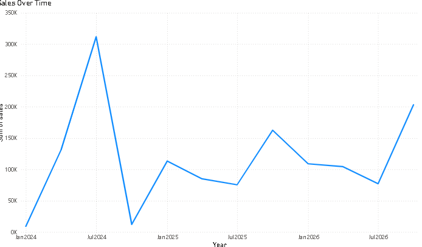
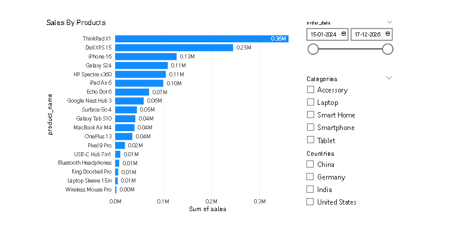

# Customer Orders Analysis – Power BI Dashboard

## Project Overview
This project analyzes customer and order data using **Power BI** to generate meaningful business insights.  
The dashboard helps understand **sales performance**, **product contribution**, and **sales trends over time**.

---

## Tools & Technologies
- Power BI  
- Excel / CSV files  
- Power Query  
- Data Modeling  
- DAX (basic measures)  

---

## Dataset
- `customers.csv` – customer information  
- `orders.csv` – order details including product, category, sales, date, and country  

---

## Data Preparation & Modeling
- Cleaned and transformed data using Power Query  
- Established relationships between Customers and Orders  
- Created calculated measures for KPIs such as total sales and order count  

---

## Dashboard Insights
- Total sales and order count  
- Product and category-wise sales contribution  
- Sales trends over time  
- Top performing products  
- Order and sales distribution analysis  

---

## Dashboard Preview
  
  

---

## Key Learnings
- Built interactive dashboards using Power BI  
- Applied data modeling concepts  
- Presented business insights using data visualization  

